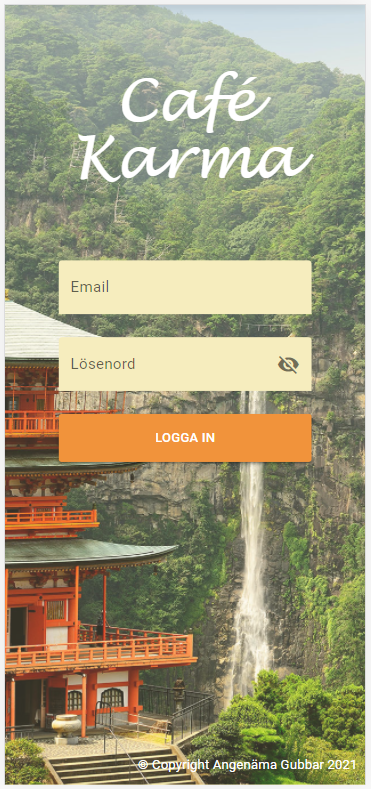
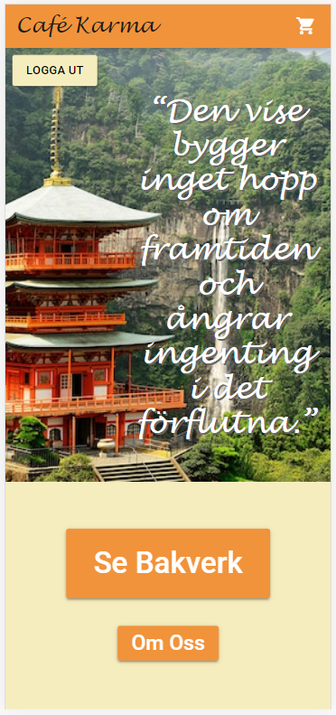
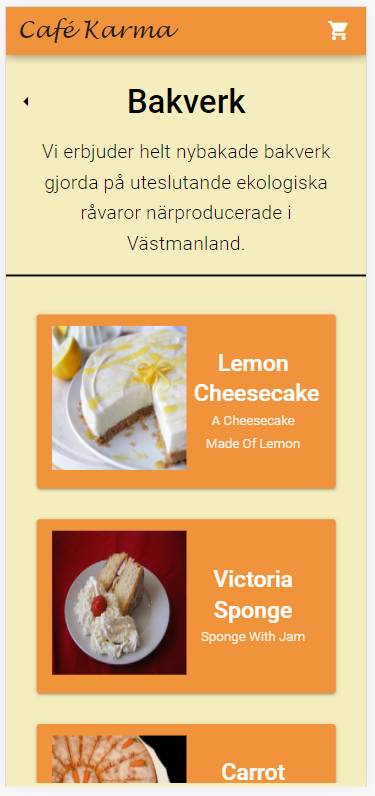
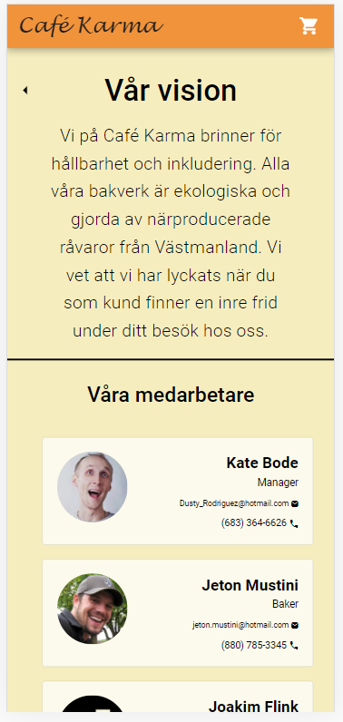
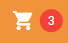
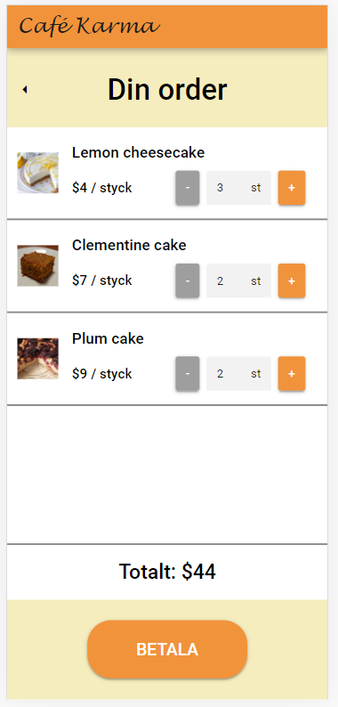
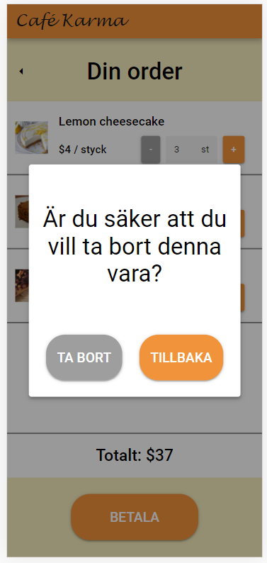

# Café Karma

Café Karma är ett modernt och trendriktigt buddhistiskt konditori. I denna repo hittas konditoriets app. En app valdes för att göra beställningarna så smidiga som möjligt, eftersom att många idag har med sig mobilerna vart de än går. Appen är designad för iPhone X.

## Designen
**Färgval**

Som appens primära färg valdes orange, då det är en typiskt buddhistisk färg som exempelvis buddhistiska munkar brukar bära. Det har även fördelen att få appen att kännas varm och välkomnande. Som bakgrund valdes en ljus nyans av orange/brunt, som bidrar ytterligare till att ingiva en känsla av värme och lugn i appen, vilket för många är vad buddhismen handlar om. Genom hela appen har vi försökt undvika utstående färger och starka kontraster mellan färger för att inte störa lugnet i appen. Detta bidrar även till att appen får en ren och modern känsla. För att lättare navigera runt i appen har knappar och interaktiva komponenter fått en lite mer intensiv orange färg. Detta gör det tydligt att de är tänkta att trycka på, och användaren behöver inte fundera på hur den ska navigera sig runt.

**Omslagfoto**

Både login-skärmen och hemskärmen innehåller en bild på ett buddhistiskt tempel i en djup skog med ett vattenfall i bakgrunden, vilket är något som återigen inger en känsla av lugn, samtidigt som det förstärker intrycket av appens buddhistiska inslag. Templet är dessutom i en färg som matchar appens primära färg, vilket får bilden att passa in bättre och inte kännas påtvingad.

  
  

**Header**

Längst upp på varje sida (förutom loginsidan) finns en orange header, där konditoriets namn syns samt kundvagnen. Denna har funktionen att förstärka orange som appens primärfärg och ser till att man inte glömmer vad det är för app man använder. Utöver detta fungerar dessutom både namnet och kundvagnen som knappar. Namnet tar dig tillbaka till hemskärmen och kundvagnen tar dig till kundvagnssidan. Detta är standard på många moderna appar, och utan dessa två finns risken att appen känns klumpig och svår att navigera igenom.

**Språk**

En detalj som finns i appen är att svenska och engelska blandas. Detta är delvis avsiktligt. Huvudspråket på appen är svenska, då det är den marknaden vi skapat appen för. Däremot är vissa saker, såsom medarbetarnas titlar och bakverkens namn på engelska. Detta är medvetet, då det ger en modernare touch på appen. Det låter lite mer exklusivt och spännande med titlar och namn på engelska. Något som inte är helt avsikltigt är att alla beskrivningar av bakverk är på engelska och priserna är i dollar. Dessa hade hellre varit på svenska, men eftersom att all data var förbestämd så fick det bli en kompromiss. Vi tycker att de engelska titlarna ger mer än vad de engelska beskrivningarna tar ifrån, men det är självklart en möjlig förbättringsmöjlighet. 

## UX (Användarupplevelse)

Appen har designats för att vara enkel att använda med mobilen. Huvudfokus har varit att presentara informationen på ett tydligt sätt och undvika onödigt många steg och knapptryck.

**Presentation av bakverk**

På bakverkssidan är alla bakverk presenterade med varsin ruta. Eftersom applikationen är mobilanpassad är det viktigt att varje ruta är tydlig och lätt går att trycka på. Av den anledningen presenteras bakverken med en ruta per rad, och för att läsa mer om varje bakverk kan man trycka på hela rutan. Detta ger en snabb överblick och enkel möjlighet att läsa mer om varje bakverk samt lägga till de i varukorgen.

**Presentation av medarbetare**

För presentationen av medarbetare har varje medarbetare varsin ruta. Denna har en ljusare nyans än bakgrunden. Detta har två anldedningar: det blir tydligt att rutorna inte är klickbara och texten blir mer lättläslig då kontrasten mellan text och bakgrund är större. Den ljusa nyansen inger mer lugn och värme än om rutorna varit helt vita, vilket skulle ge hela sidan för skarpa kopntraster.

**Placering av knappar**

Genomgående har valet av placering av knappar byggt på att det ska vara enkelt att navigera runt mellan sidorna. Därför har majoriteten av knappar som ofta används placerats långt ner på skärmen för att lättare gå att trycka på. Knappar som inte används lika ofta, som exempelvis "logga ut" är placerad högt upp på skärmen för att inte lika lätt råka trycka fel. Kundvagnsknappen är placerad uppe till höger och tillbaka-knappar uppe till vänster. Detta eftersom det är standard att placera dessa knappar där, vilket gör att användare lätt kan känna igen sig i appen.

**Kundvagns-knappen**

För att ta sig till betalningssidan måste man trycka på kundvagnsknappen uppe i högra hörnet då det inte finns några knappar för det någon annanstans. Detta är ganska vanligt förekommande på moderna appar och hemsidor, och många som är vana vid mobiler kommer känna igen upplägget. För att förtydliga knappens funktion dyker det upp en röd cirkel bredvid knappen när något lagts in i kundvagnen. Den röda pricken är för att ytterligare förtydliga att det är en knapp, så att även en mer ovan person skulle kunna hantera appen utan några större besvär. Den röda färgen valdes för att det är en färg som sticker ut och syns tydligt, samtidigt som den inte är alltför olik appens övriga färger. Utöver det ryms även en siffra inom pricken, som visar hur många olika sorters bakverk man har i kundvagnen.

**Betalningssidan**

På betalningssidan (kundvagnssidan) kan man se alla varor man valt, hur många man valt av vardera samt deras styckpris. Man har även möjlighet att justera antalen antingen med + och - knapparna, eller genom att skriva in direkt i rutan där antalet visas. Självklart visas även prissumman av alla varorna.

För att undvika att kunder ska kunna lägga tomma ordrar tas varorna bort om deras antal sätts till noll. För att undvika att kunden skulle råka ta bort något och behöva gå tillbaks och göra om beställningen används en pop-up ruta för att försäkra om att användaren inte tryckt fel. Om användaren sätter en vara antal till mindre än 1 tillfrågas den om den vill ta bort produkten från varukorgen eller behålla den.

  
  

## Testning

Testning har utförts genom Ad Hoc testning som är olika testmetoder som utförs genom att använda applikationen.
Först gjordes en så kallad "Monkey Testing" där randomiserad input och knapptryckningar gjordes i appen.
Sedan prövades olika testcase utifrån våra erfarenheter av vad som potentiellt kan orsaka fel.

Till en början identifierades att det gick att sätta ett negativt antal av bakverk i ordern.
En funktion för detta var implementerad, en pop-up ruta med alternativen att behålla varan (minst antalet 1), eller att ta bort den. Det visade sig att det gick att klicka utanför pop-up rutan och på så vis ignorera någon av alternativen. Vi ändrade så att det inte gick att trycka bort pop-up rutan på något annat sätt än knapparna.

En annan sak som visade sig var att orderinformation sparades även efter att man loggat ut. Om en person loggar in och påbörjar en order, sedan loggar ut och en annan person loggar in ligger den gamla ordern kvar. Detta fixades genom att tömma all lokal information i klienten vid utloggningen.

## Utvecklingsmöjligheter och förbättringar

En av de viktigaste förbättringarna som finns att göra är att göra appen responsiv, d.v.s. att den anpassar sig efter mobilen som appen körs på. I nuläget är appen designad enbart med iPhone X i åtanke, vilket kan leda til att appen ser annorlunda ut på andra enheter. Detta kan få oönskade konsekvenser, såsom att knappar och text flyttas och hamnar på fel ställen. Eftersom att allt i appen är noga uttänkt kan det leda till att användarvänligheten får lida.

Ytterligare en förbättringsmöjlighet skulle kunna vara att lägga in någon slags profil-sida, eller åtminstone något sätt som personen kan se att den är inloggad. I nuläget finns den ingen personlig info i appen, vilket gör det otyldigt vem som har loggat in i appen. Genom att lägga till lite info skulle man kunna se till att öka tydligheten i appen, samtidigt som man skulle kunna lägga till lite info för att underlätta beställnings- och hämtningsprocessen för användaren. Exempelvis skulle man kunna lägga in sitt nummer för att underlätta swish-betalningar eller lägga in en mail för att få digitala kvitton skickade till sig direkt vid beställning.

Självklart skulle det också vara bra om det implemeterades något sätt att skapa ett nytt konto, något som i nuläget inte finns.

Något som också skulle kunna impementeras är en sida där man kan se tidigare beställningar. Det skulle vara bra för kunden att ha något sätt att se vad som har beställts och inte, men i nuläget så är det endast personer med åtkomst till databasen som kan göra det. Detta skulle kunna lösas genom att använda sig av digitala kvitton som nämndes tidigare, men det skulle även kunna vara bra att ha något inbyggt i appen. Då behöver man som användare inte gå in i en annan app och scrolla igenom sin inkorg för hitta sina kvitton. I denna sida skulle man även kunna implementera ett slags statussystem, så att användaren vet när bakverken är redo för upphämtning och inte om det behöver bakas nya. 

En annan idé som fanns var att byta göra ett bildspel på hemskärmen så att man kan svepa emellan flera olika fridfulla bilder med inspirerande citat. Man skulle alternativt kunna göra så att det slumpas en ny bild och citat vid varje inloggning, så att hemskärmen ser lite annorlunda ut varje gång. Det gör appen lite mer spännande att använda, och får den att kännas mer dynamisk. Det finns även utrymme för att låta användaren bestämma, så att varje användare kan göra appen lite mer personlig. Man skulle exempelvis kunna välja att ta bort citaten och bara visa bilder, eller välja en viss sorts bilder som ska visas.
